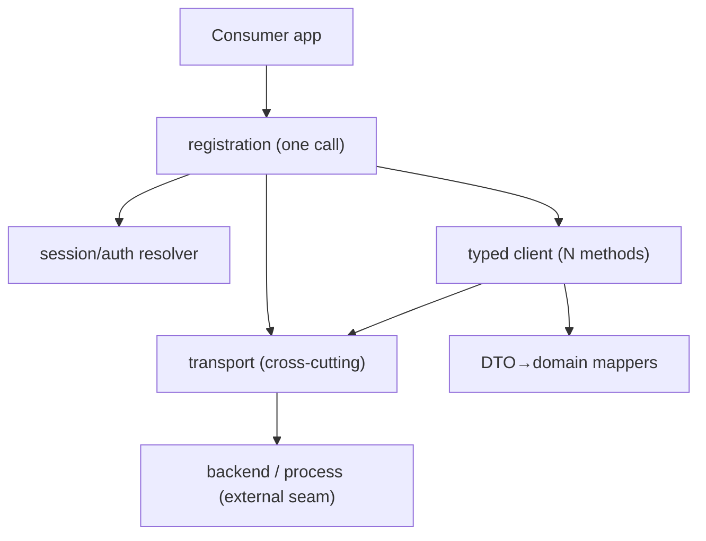

# SDK architecture standard — the third deliverable

An SDK is **three** things, not two: a typed client, line-by-line documentation, **and an
architecture record** that shows how the client is shaped and *why*. The architecture record is what
lets a maintainer change the SDK without breaking its shape, and what proves the seams are in the
right places. A submission with a client and docs but no architecture record has shipped a black box.

It draws on the FutureBank SDK for the adaptor seam, sequence diagrams, and dependency trees, and on
the **deep-module** vocabulary (the depth audit + decision record) for the rest. Every SDK produces
all three artifacts below.

## The three architecture artifacts

### 1. Module-dependency diagram

A diagram of what depends on what — the SDK's internal modules **and** the one external seam (the
backend / transport). Mermaid `graph TD` is the default; an interactive sequence-diagram link
(sequencediagram.org, read-only) or a dependency *tree* (the iOS practice) is acceptable when that's
the team's house style. Requirements:

- Every module the SDK ships appears as a node.
- The **single external seam** is marked (the HTTP backend, the stdio process, the gateway). If there
  is more than one external seam, that is a finding to call out, not to hide.
- The graph is **acyclic and one-directional** — registration composes the parts; parts don't depend
  back up. If there's a cycle, the diagram exists to surface it.
- Deep vs thin modules are visually distinguished (color, or a legend).

### 2. Request data-flow / sequence diagram

One diagram showing what happens on a single call, end to end: caller → client method → cross-cutting
(correlation, retry, logging) → transport → backend → response → mapper → typed result. This is the
diagram that proves the cross-cutting concerns happen **once, in one place**, not per method.
FutureBank ships these as shareable read-only sequencediagram.org links; Mermaid `sequenceDiagram` is
equally valid.

### 3. Depth audit + decision record

Prose + a table. Two parts:

**Depth audit** — for every module, apply the **deletion test**: imagine deleting it. If complexity
vanishes, it was a pass-through (shallow); if complexity reappears across N call sites, it earned its
keep (deep). Record the verdict per module. A module is **deep** when a lot of behaviour sits behind a
small interface; **shallow** when its interface is nearly as complex as its body. Cross-cutting
(auth/correlation/retry/logging) belongs in ONE deep module, never duplicated per operation — the
audit is how you prove it.

| Module | Interface (what a caller must know) | Deletion test | Verdict |
|--------|-------------------------------------|---------------|---------|
| transport | `call(op, args) → result` + lifecycle | delete → correlation+retry+logging reappear at every call site | **Deep** |
| mappers | one `map(dto) → domain` per op | delete → parsing/shape logic reappears in every consumer | **Deep** |
| registration | `addSdk(options)` | delete → every consumer hand-wires the parts | **Deep** |
| client | one method per operation | delete one → only its arg-mapping vanishes | **Thin per method, deep in aggregate** |

**Decision record** — the architectural decisions, each as: **Decision · Alternative rejected · Why.**
At minimum cover:

- **One method per operation vs a generic `call(name, args)`** — depth is leverage for the caller; the
  named methods move the knowledge into the module (autocomplete, compile-time checks, typed result).
- **Where the mappers sit and what they're coupled to** — and what changes when the backend's response
  format changes (the seam should localize that).
- **Why cross-cutting lives in the transport, not per method** — the deletion test settles it.
- **The adaptor seam, if any** — *one adaptor is a hypothetical seam; two adaptors is a real one.*
  FutureBank has three (Gateway, Direct-Transact, Mock) behind one `IBankingAdaptor` contract,
  switchable by which `AddXSdk()` the consumer registers — that's a real seam and the record says what
  varies across it (timeout, routing header, backend). Don't introduce an adaptor interface for a
  single implementation.
- **Lazy vs eager connect / init**, and any ordering invariant the consumer must honour.

## The seam discipline (carry this into every decision)

- **One adapter means a hypothetical seam. Two means a real one.** Don't add an interface at a seam
  nothing varies across.
- **The interface is the test surface.** If a test needs to reach *past* the interface, the module is
  the wrong shape — fix the shape, don't punch a hole.
- **Adding an operation** should touch the client (one thin method) and maybe a mapper/type — never
  the transport or session. If it touches the transport, the seam is in the wrong place.
- **A second backend transport** (e.g. an HTTP deployment of a stdio service) should touch only the
  transport module; the client, mappers, and every consumer stay unchanged. That invariance is the
  payoff of one external seam, and the architecture record is where you assert it.

## Completion criterion

The architecture record passes when: a maintainer who has never seen the SDK can, from the three
artifacts alone, (1) draw the dependency graph and name the single external seam, (2) trace one call
end-to-end and point to where correlation/retry/logging are applied, and (3) for any module, state
whether it's deep or shallow and why — and for any seam, say what varies across it. If the record
can't answer "what would I have to change to add an operation / swap the backend / add a second
platform," it is incomplete.
